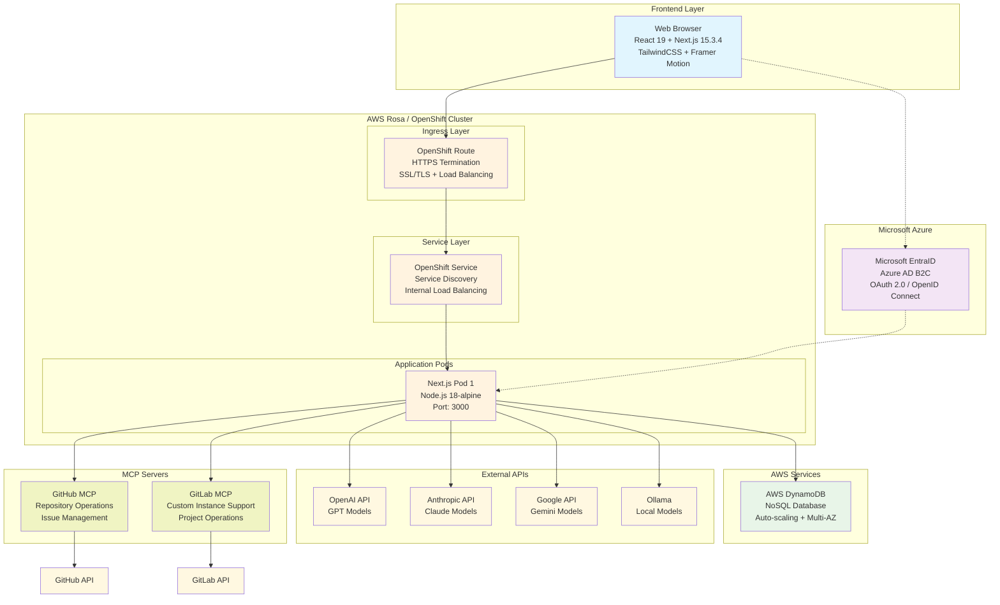
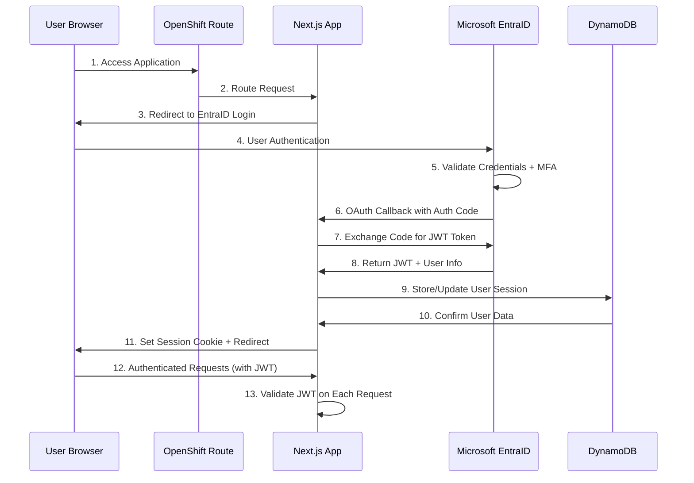
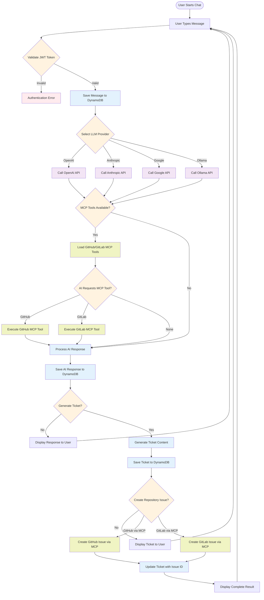
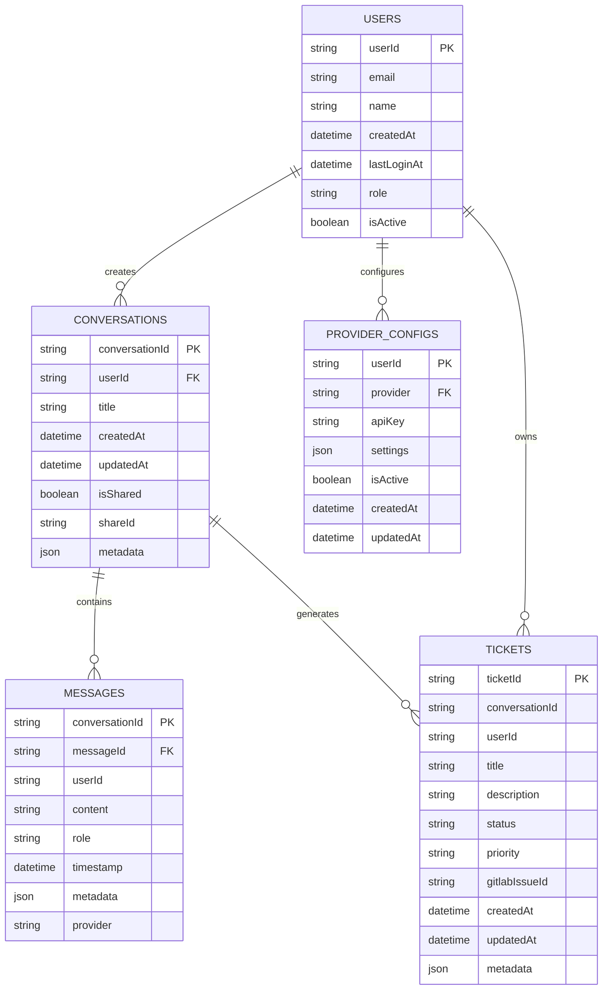
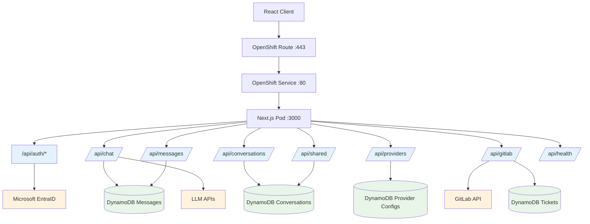
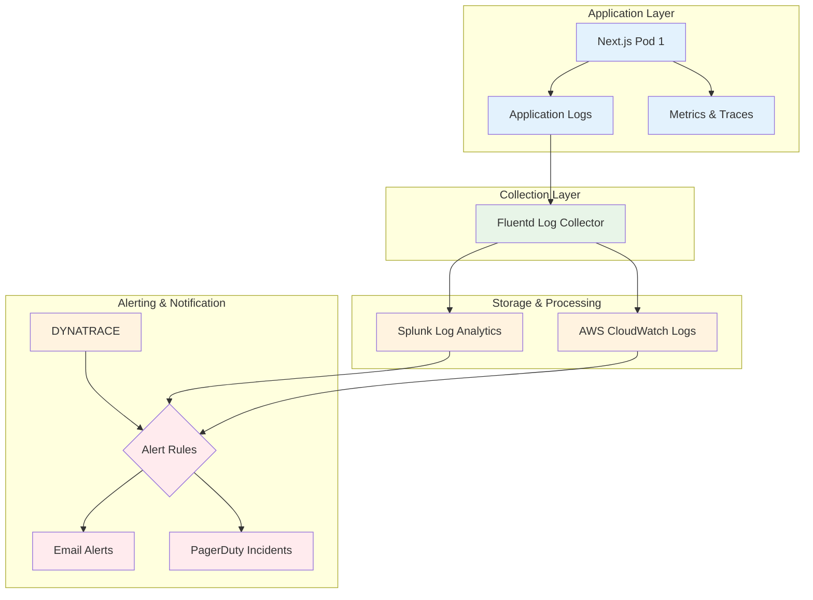
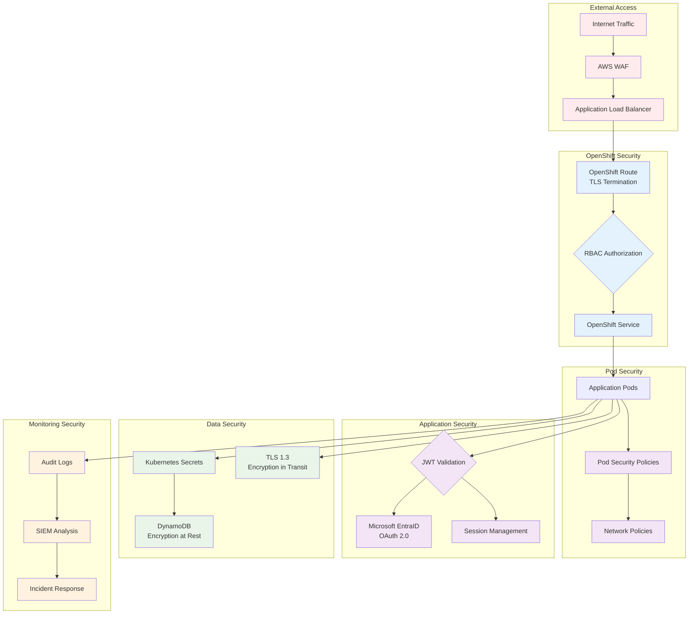
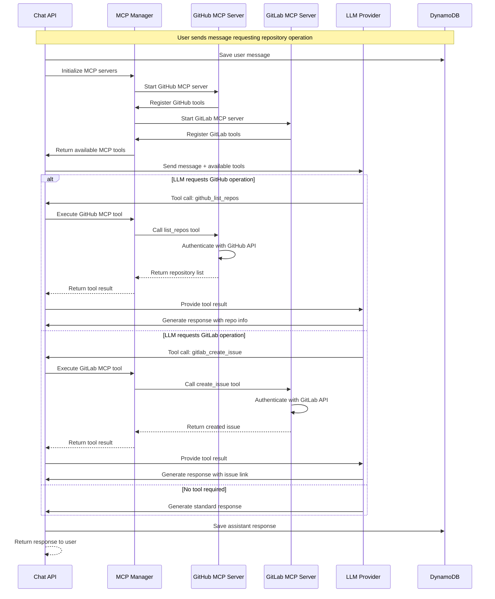

# AI Ticket Automation - Mermaid Diagrams

## System Architecture Overview

## Authentication Flow with EntraID

## Chat & Ticket Generation Flow

## Database Schema Relationships

## AWS Rosa Deployment Flow

```mermaid
flowchart LR
    subgraph "Development"
        DEV[Developer Push] --> GIT[Git Repository]
    end

    subgraph "CI/CD Pipeline"
        GIT --> BUILD{Build & Test}
        BUILD -->|Success| CONTAINER[Build Container Image]
        BUILD -->|Failure| FAIL[❌ Build Failed]
        CONTAINER --> ECR[Push to ECR Registry]
    end

    subgraph "AWS Rosa OpenShift"
        ECR --> DEPLOY[Deploy to OpenShift]
        DEPLOY --> CONFIG[Apply ConfigMaps & Secrets]
        CONFIG --> PODS[Create/Update Pods]
        PODS --> HEALTH{Health Checks}
        HEALTH -->|Pass| LIVE[✅ Application Live]
        HEALTH -->|Fail| ROLLBACK[↩️ Rollback to Previous Version]
    end

    subgraph "Monitoring"
        LIVE --> METRICS[Collect Metrics]
        METRICS --> ALERTS{Alert Conditions}
        ALERTS -->|Normal| DASHBOARD[Update Dashboard]
        ALERTS -->|Issues| NOTIFY[Send Notifications]
    end

    classDef dev fill:#e8f5e8
    classDef cicd fill:#e3f2fd
    classDef deploy fill:#fff3e0
    classDef monitor fill:#f3e5f5
    classDef success fill:#e8f5e8
    classDef error fill:#ffebee

    class DEV,GIT dev
    class BUILD,CONTAINER,ECR cicd
    class DEPLOY,CONFIG,PODS,HEALTH deploy
    class METRICS,ALERTS,DASHBOARD,NOTIFY monitor
    class LIVE,DASHBOARD success
    class FAIL,ROLLBACK error
```

## API Endpoints Flow

## Monitoring & Observability

## Security Architecture

## MCP Tool Integration Flow

